<!-- assets/*.svg are generated: npm install figlet, then node scripts/build-svgs.js assets -->

### About me

- 📊 I explore data and build machine learning models in Python, then turn the results into Power BI dashboards.
- 🛠️ I build web apps end to end with React, Next.js and FastAPI, from the database to deployment.

### Live projects

<table>
  <tr>
    <td width="50%" valign="top">
      <h4>🔐 Beyond the Password</h4>
      A cybersecurity awareness site with a password-habits survey, a public results dashboard and admin reports.
        
      
      
      
        
      
    </td>
    <td width="50%" valign="top">
      <h4>📐 <a href="https://github.com/HsnAQA/estimate-456">estimate-456</a></h4>
      Software project estimation with SLOC, Function Points, COCOMO and Delphi, with worked solutions.
        
      
      
      
        
      
    </td>
  </tr>
</table>

### Tech stack

<b>Everything I have worked with</b>, grouped, most recently used first

 
<table>
  <tr>
    <td><b>Languages</b></td>
    <td></td>
  </tr>
  <tr>
    <td><b>Frontend</b></td>
    <td></td>
  </tr>
  <tr>
    <td><b>Backend and databases</b></td>
    <td></td>
  </tr>
  <tr>
    <td><b>Data and machine learning</b></td>
    <td>
      
       
      
      
      
      
      
    </td>
  </tr>
  <tr>
    <td><b>Testing and quality</b></td>
    <td>
      
      
      
    </td>
  </tr>
  <tr>
    <td><b>Desktop</b></td>
    <td></td>
  </tr>
  <tr>
    <td><b>Tools and cloud</b></td>
    <td></td>
  </tr>
</table>

### Latest project

<table>
  <tr>
    <td width="42%" align="center" valign="middle">
      
    </td>
    <td valign="top">
      <h3>🕯️ Wick (فتيل)</h3>
      A private burnout self-assessment based on the Maslach Burnout Inventory: 22 statements, three dimensions, and results that never leave the device.
        
      <b>Latest work</b>
      <ul>
        <li>New logo, themes and redesigned screens</li>
        <li>A home page that fits on one screen, with smooth motion</li>
        <li>Instant switching between Arabic and English</li>
      </ul>
      
      
      
      
        
      
    </td>
  </tr>
</table>